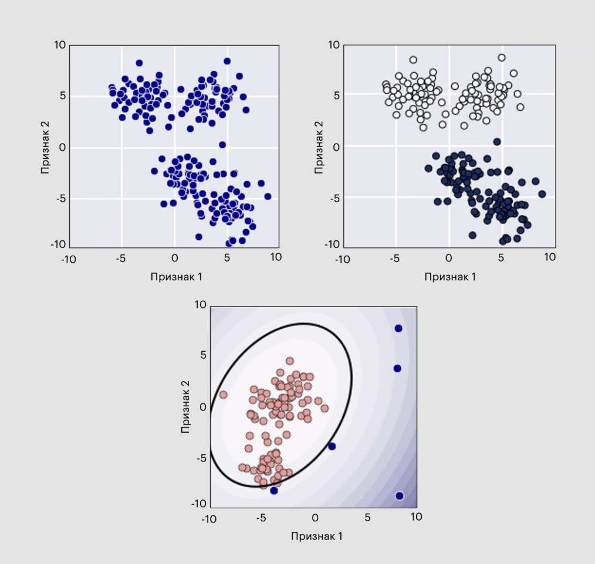
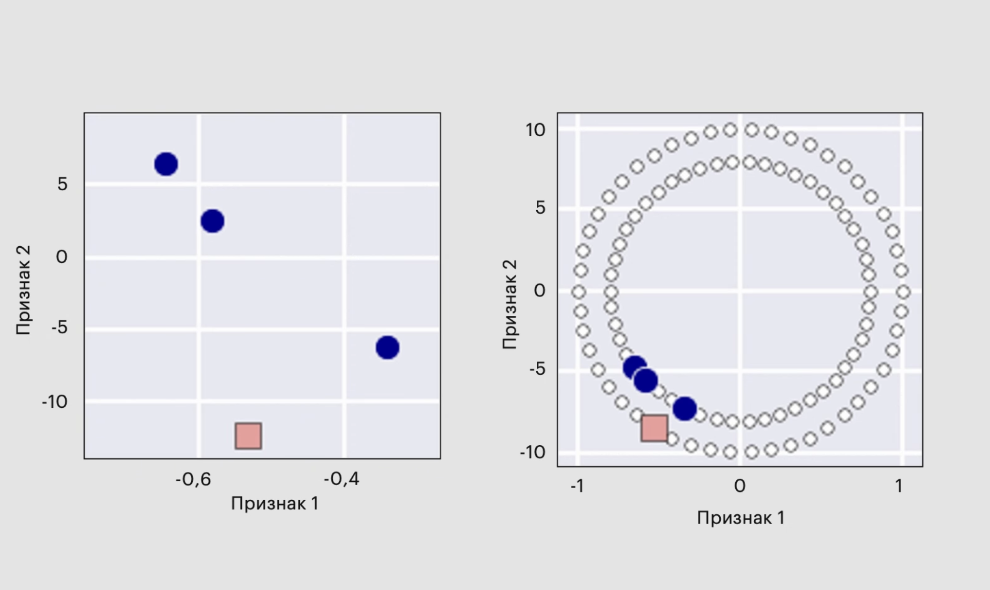
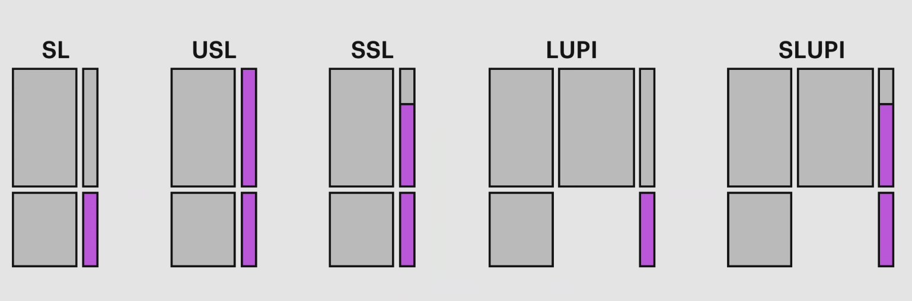
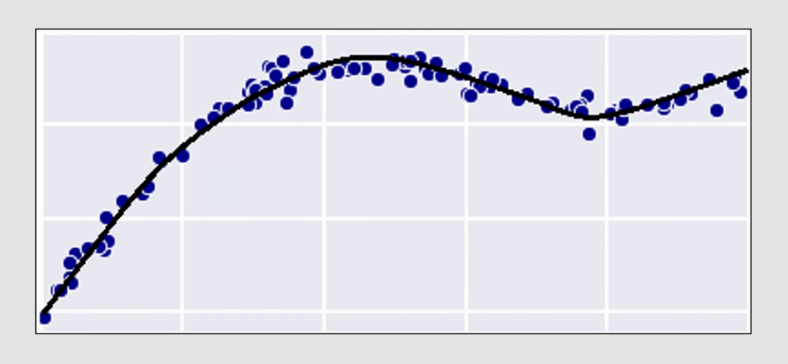
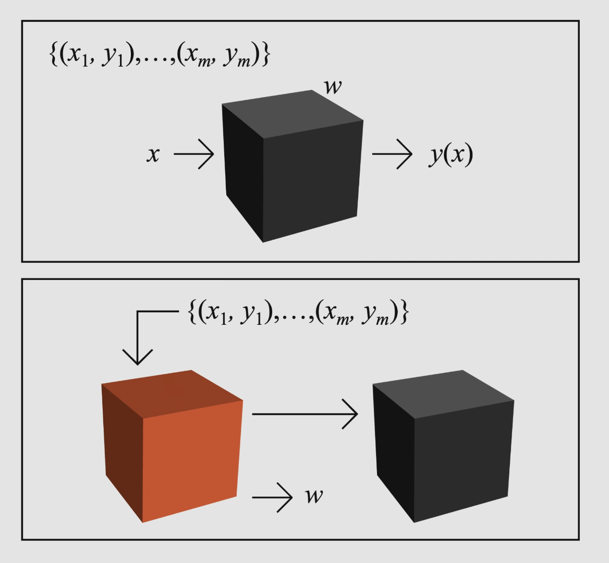

# Как решаются задачи?

## Параметрический подход 

**Пусть** $y = f(X_1, ..., X_n) + \eps$

- $y$ - продажи
- $X_1$ - затраты на рекламу в Интернете
- $X_3$ - завтраты на рекламу на радио, и т.д.
- $\eps$ - неустранимая ошибка (irreducible error)

**Надеемся** $a(X_1, ..., X_n)$ -- не успел что там дальше

### Параметрические модели

**Линейная модель** ~ простая, хорошо интерпретируемая  $a(X_1, ..., X_n) = w_0 + w_1 X_1 + ... + w_n X_n$

Параметры оцениваются с помощью подгонки на данных обучения
- $w_i$ - веса \ параметры модели
- $w_0$ - смещение (bias) 

**Более сложная полиномиальная модель** $a(X_1, ..., X_n) = w_0 + \sum_t w_t X_t + ... + \sum_{i, j} X_i X_j$

Проще настроиться на данные, но возникает проблема – переобучение - качество на контроле существенно ниже, чем на обучении

## Обучение без учителя

$$X_{train} = \{x_1, ..., x_m\} \subseteq X$$

**Понять "структуру" пространства объектов
- Как на нём распредлены объекты?
- Можно ли его разделить на подпространства похожих объектов?
- Можно ли эффективно описать объекты\пространство?

**Часто нет понимания, насколько хорошо решается задача**

## Другие виды обучения

### Обучение с частично размеченными данными 
**Semi-supervised learning** 

$$X_{train} = \{(x_1, y_1), ... (x_k, y_k), x_{k+1}, ..., x_m \}$$
Если заранее известна контрольная выборка x_1^', ... x_q^', то это трансдуктивное обучение 

### Привилегированное обучение
Learning Using Privileged Information
$$X_{train} = \{(x_1, \tilde x_1, y_1), (x_m, \tilde x_m, y_m)\}$$
$$X_{test} = \{x_1^', ..., x_k^'\} $$

Только на обучении есть дополнительные признаки

### Обучение с подкреплением
**Reinforcement Learning** - обучение агента, который взаимодействует 
со средой и получает награду за взаимодействие

### Структурный вывод
**Structured output** – на выходе набор значений со связями между ними

Примеры:
- Грамматический разбор: текст $\rightarrow$ дерево
- Аннотирование изображений: изображение $\rightarrow$ текст
- Транскрипция: $X \rightarrow$ текст
- Машинный перевод: текст $\rightarrow$ текст
- Синтез: выборка $\rightarrow$ выборка

### Активное обучение
**Active Learning** - влияем на формирование обучающей выборки

### Обучение с переносом опыта
**Transfer Learning** - решение новых задач с помощью решения старых

### Онлайн-обучение
**Online learning** - в каждый момент времени нам доступна небольшая группа объектов

### Multitask Learning
**Multitask learning** - решение одновременно нескольких сложных задач

### Обучение представлений
**Representation Learning** - оптимальное представление объектов, в частности, выучивание признаков
(Feature Learning) - автоматическое получение хороших признаков из сырых данных, обучение многообразий (Manifold Learning)m
матричные и тензорные разложения и т.п.

### Обучение глубоких сетей
**Deep Learning** – решение задач ML с помощью глубоких нейросетей

### Мета-обучение
**Meta-Learning** - обучение обучаться (например, подбор оптимальных параметров с помощью машинного обучения)

## Сложности в ML
**Переобучение - основная теоретическая проблема**
- **Проблема формализации** - надо переформулировать бизнес-задачу в математическую
задачу выявления зависимости, выбрать адекватную функцию ошибки
- **Размеры данных** много объектов (низкого уровня – транзакций, высокого - клиентов),
много признаков (обработка текстов)
- **Качество данных** невыполнение всех свойств (полнота, корректность,
правдивость, ясность и т.п.)
- **Несоответствие обучения и контроля** это больше, чем проблема репрезентативности
выборки – это проблема прогноза / адаптации (распознавание голоса, спама) 

## Итог
**Обучение с учителем – восстановление целевой зависимости, формализуется с помощью 
функции ошибки**
- Объекты произвольны, но мы дальше рассматриваем признаковые описания
- Минимизируем эмпирический риск в рамках модели, необходима обобщающая способность
- В отличие от оптимизации ответ – алгоритм есть прикладной контекст (много дополнительных требований)
- Схемы решений задач вполне естественны, алгоритмы просты, например, линейный
- Есть много видов машинного обучения, начнём с обучения по размеченным данным 