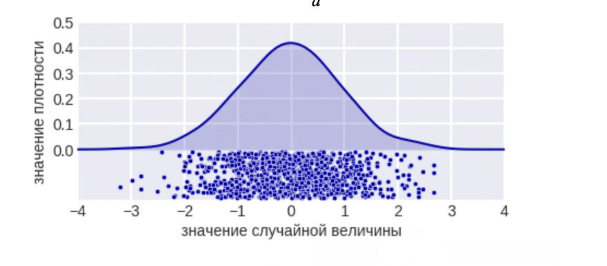

# Математика в машинном обучении: краткий обзор
Александр Дьяконов 

## Бритва Оккама
- Сущности не следует умножать без необходимости.
- Из всех гипотез, объясняющих данные, надо выбирать простейшую
- Объяснение должно быть наипростейшим, но не проще... 

## Теорема о бесплатном сыре 
В среднем (по всем возможным порождающим распределениям) у всех алгоритмов процент ошибок одинаков...

**Сложность** -- чуть позже коснёмся

**Простота алгоритма** -- MDL, порядок полинома, ...

**Простота модели** - VC размерность, ...

## Футбольный оракул

**Будете ли вы верить предсказаниям?**

Если начать с 1/16 финала и распараллелить х10 (обзвонить 160 человек), 
то перед финалом 10 человек, которым безошибочно сказали 4 исхода!

аналогично, если бы мы случайно давали прогнозы...

**Важно правильно формировать выборку и ставить эксперимент!** 

## Сведения из ТВиМС
Вероятность события ~ доля испытаний, завершившихся наступлением события, при бесконечном числе экспериментов

> Есть и другой подход к пониманию вероятности! ЗБС: частота $\rightarrow$ вероятность

Теория вероятностей и математическая статистика отличается тем, что в ТВ по гипермараметрам пытаются понять, как пойдёт эксперимент,
в то время как матстат пытается понять какие были параметры по экспериментам

**Что надо знать?**
- Как задать распределение с.в. /xi
- Если принимает значения $x_1, x_2, ...,$ то вероятностями
$$ p_1 = P(\xi=x_1), p2 = P(\xi=x_2), ..., \sum_i p_i = 1, p_i \geq 0$$

Если $\xi \in \mathbb{R}$, то функцией распределения 
$$ p(x): F_{\xi} (x) = \int_{-\inf|^x p(z)\delta z$$ 
удобна тем, что 
$$ P(a \geq \xi \geq b) = \int_a^b p(x)\delta x$$

**Связь плотности и вероятности** 

### Примеры распределений из жизни: сбербанк 

### Примеры распределений из жизни: тикетлэнд

Пусть с.в. имеет плотность $p(x)

**Математическое ожидание** (~центр масс) - $E X = \int xp(x)\delta x$

**Дисперсия** (средний квадрат отклонения от МО) - $E(X - EX)^2 = \int (x - EX)^2 p(x) \delta x$ 

> Можно рассматривать и другие средние и отклонения квантиль, медиана, мода

**Условная плотность** - $p(x|y) = \frac{p(x, y}{p(y)}$

Использовать первый вариант (маргинализация), когда знаем $y$

Использовать второй вариант (обуславливание), когда не знаем $y$

### Правило произведения
$$ p(x_1, ... x_n) = p(x_1 | x_2, ..., x_n) p(x_2 |x_3, ..., x_n) ... p(x_{n-1}|x_n) p(x_n))

### Точечное оценивание
**Зачем нужно?** 

Наша же цель найти истинные значения параметров модели

Выборка $\{x_1, ..., x_m\}$ 

независимые случайные одинаково респределённый случайные величины

Статистичкая (точечная оценка) - (измеримая) функция от выборки 

**Требования к статистике**
- Значение должно быть близко к истинному значению параметров модели $\teta$ 
  - Смещение $bias(\teta) = E \hat{\teta} - \teta$
  - Несмещенная оценка $bias(\hat{\teta}) = 0$ 
  - Асимптотически несмещённая оценка  $bias(\hat{\teta}) \rightarrow 0$ 
  - Для нормального распределения несмещённые оценки
- Оценка не должна сильно варьировать в зависимости от выборки
  - $var(\hat{\teta}) \rightarrow min$
- С ростом числа наблюдений должна быть сходимость 
  - Состоятельность $\forall \eps \geq 0 P(|\hat{\teta} - \teta| \geq \eps) \rightarrow 0$ при $m \rightarrow \inf$

## Оценка Maximum Likelihood Estimation (MLE | ММП)
Если у нас есть какая-то выборка, которая состояит из независимых одинаковое распределённые величины и 
мы знаем, что они распределены с помощью какой-то вероятенсти $\teta$ 

## Ковариация и корреляция 
