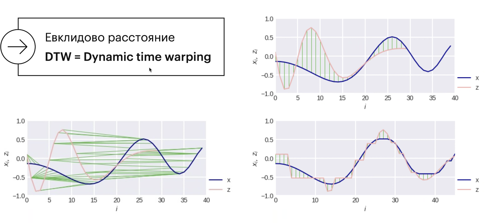

# Тут я всё пропустил минут на 10

## Ближайший центроид

Nearest centroid algorithm

Звадача классификации на пересекающие классы с вещественным признаками

И тут формулы пропустил


Плюсы:

- Хранить только центроиды (их можно адаптивно менять)
- Понятие центроида можно менять ("Средний объект")
- Простая реализация
- Размер модели = число классов * описание центроида

Минусы:

- Очень простой алгоритм (Интуитивно подходит в задачах, где объекты разных классов распределены "колоколообразно")

### Минутка кода

```python
from sklearn.neighbors.nearest_centroid import NearestCentroid

model = NearestCentroid(metric='euclidean')
model.fix(X, y)
a = model.predict(X2)
```

## Подход, основанный на близости

**Задача классификации:** $a(x) = mode(y_i | x_i \in N(x))$

**Задача регрессии:** $a(x) = mean(y_i | x_i \in N(x))$

## Метод k ближайших соседей (kNN)

Гиперпараметр k (а также метрику, ядро и т.п.) можно выбрать на скользящем контроле (об этом потом)

**Термины:**

- Нетерпеливый алгоритм:  Обучение - получение значений параметров. После обучения данные не нужны
- Ленивый алгоритм: Не использует обучающую выборку до классификации, нормально нет обучения - храним всю выборку

## Решение модельной задачи

При разном числе соседей


При большом k почти плавная прямая, при маленьком k строго делят

k отвечает за "Сложность модели"

### Минутка кода

```python
from sklearn.neighbors import KNeighborsClassifier

model = KneighborsClassifier(
    n_neighbors=5,  # число соседей  
    algorithm='auto',
    leaf_size=30,
    wights='uniform',
    metric='minkowski',
    p=2,
    metric_params=None)
model.fit(X, y)
a = model.predict(X2)
p = model.predict_proba(X2)[:, 1]  
```

## Регрессия

### Метод ближайшего соседа в регрессии

Обобщается на регрессию


### Подбор гипермараметров

Специальными методами контроля

### Минутка кода

```python
from sklearn.model_selection import Kfold

cv = Kfold(n_splits=10, shuffle=True, random_state=2)

from sklearn.neighbors import KneighborsClassifier

model = KneighborsClassifier(n_neighbors=5)

param_name = 'n_neighbors'

pars = np.arrange(1, 41)

from sklearn.model_selection import validation_curve

train_errors, test_errors = validation_curve(model,
                                             X, y,
                                             param_name=param_name,
                                             param_range=pars,
                                             cv=cv.split(X),
                                             scoring='accuracy',
                                             n_jobs=-1)
```

## Проблема классического kNN


### Весовые обобщения kNN

- Классика $mode(y_i | x_i \in N(x)) = argmax \sum_{t=1}^k I\[y(x_t) = a\]$
- Обобщение $argmax \sum_{t=1}^k w_t I\[y(x_t)) =a \]$
- Разные весовые схемы $w_1 \geq w_2 \geq ... \geq w_k > 0$

### Весовые схемы

Часто веса лучше нормировать, чтобы сумма была равна 1

Главное преимущество – богатое пространство вероятности в задачах классификации


1. При $\delta = 0$ все объекты имеют вес 1.
2. Ближайший объект 1, потом 1\2, потом 1\4 и так далее. Дельта для контроля
3. Веса это ядро от расстояния. Чем больше расстояние, тем меньше вес.

### Что такое ядро?

- Прямоугольное / tophat $K(z) = \frac{1}{2} I\[|z| \leq1\]$

### Весовые обобщения kNN


1. Если веса разные, то получается белая разделяющая поверхность ровная
2. Если небольшие отличия в весах, то видим искревление и улучшение алгоритма
3. Если ещё более агрессивную, то на картинке видно что почти повторяет идеальный контур

### Весовые обобщения в регрессии

$$ \frac{\sum^{k}_{t=1}w_t y (x_y)}{\sum^{k}_{t=1} w_t} $$

## Регрессия Надарая-Ватсона


Для одного и того же $x$ может быть два разных $y$.

Ширина ядра отличный параметр, чтобы регулировать плавность этой функции.

Главный недостаток такой регрессии: **не экстраполируется**

На концах функция становится почти константой, так что надо это учитывать.

> Часто называют сглаживанием Надарая-Ватсона


**Смысл:** Ответ алгоритма $\rightarrow$ решение оптимизационной задачи
$\rightarrow \sum_{i=1}^m w_i(x) (a - y(x_i))^2) \ rightarrow min_a$

## Приложения регрессии Надарая-Ватсона

1. Сглаживание сигналов
2. "Многомерные" усреднения
   

## Метрики

Расстояние (метрика) на $X$ -ф функция $p(x, z): X \times X \rightarrow \mathbb(R)$

1. $p(x, z) \geq 0$
2. $p(x,z) = 0 \leftrightarrow x=z$
3. $p(x, z) = p(z, x)$
4. $p(x, z) + p(z, v) \geq p(x, v)$

Примеры:

- Минковского $L_p$
    - Евклидова $L_2$ $\sqrt{ \sum_{i=1}^{n} (x_i - z_i)^2}$
    - Манхэттэнская
- Махаланобиса
- Canberra distance
- Хэмминга
- Косинусное
- Расстояние Даккара

$$(|x_1 - z_1|^p + |x_2 = z_2|^p)^{\frac{1}{p}}$$


### Расстояние Махаланобиса

Расстание Махланобиса параметрическая. Соответственно мы можем настривать коэффициент $\sigma$


### Ещё метрики


## Функции сходства

Если работать с нормированными векторами, достаточно рассматривать скалярное произведение


## Проблема выбора метрики

- Зависимость от масштаба
    - Нормировка признаков
    - Однородные признаки
    - Смесь метрик
- Можно выбирать не метрику, а близость
    - Косинусная мера сходства
- Часто выбор функции расстояния, как ни странно довольно прост...

## Метрики на временныз рядах

- Как ввести расстояние?
- Ряды могут быть разной длины
- Как оценить похожесть?



## Рсстояние Левенштейна

Расстояние между строками, вводим элементарные операции правки:

- Вставить букву
- Удалить букву
- Заменить букву

Расстояние - минимальное число операций, с помощью которых из одной строки можно получить другую

## Приложения метрического подхода: Ленкор

Соревнование "VideoLectures.Net Recommender System Challenge"

Мы знаем про пользователя только 1 просмотренную лекцию. А должны порекомендовать пользователю что-то из новых лекций,
про которые мы тоже мало что знаем .

Мы знаем название, автора, дату, аннотацию, кто заливал, кто читал

> Метрики можно параметризовать и настривать параметры
> "Хитрый весовой учёт близости" - см. совместные просмотры


