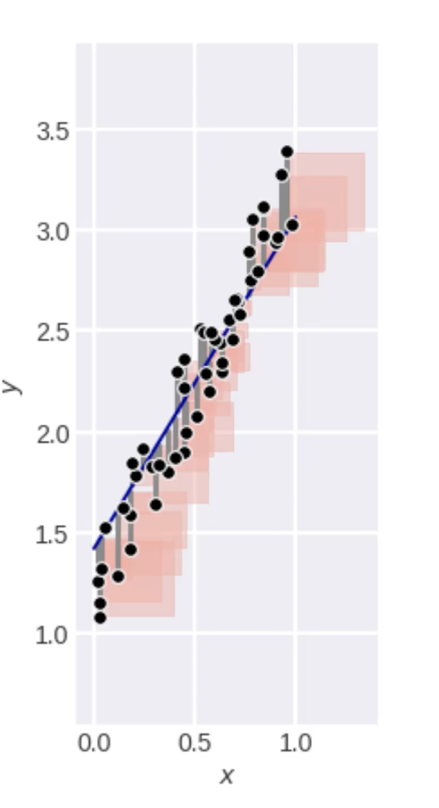

# Линейная регрессия

## Линейная регрессия

Гипотеза о линейной зависимости целевой переменной, ищем решение в виде:

- Практика
    - Часто неплохо работает и при монотонных зависимостях
    - хорошо работает, когда есть много "однородных" зависимостей

Задача минимизации суммы квадратов отклонений.

### Геометрический смысл ошибки

Площадь квадрата от невязки до регрессии. Мы минимизируем сумму площадей квадратов


4 способа борьбы с вырожденными матрицами

- Регуляризация
- Селекиця признаков
- Уменьшение размерности
- Увеличение выборки

### Регуляризация: Упрощенное объяснение смысла

Если есть два похожих объекта, то должны быть метки, пусть отличаются в $j-$м признаке, тогда ответы модели отличаются
на $\eps_j w_J$

Поэтому не должно быть очень больших по модулю весов

Теперь минимизируем не только евадрат ошибки, то и квадрат нормы весов

### Гребневая регрессия

```python
from sklearn.linear_model import Ridge

model = Ridge(alpha=0.0)

model.fit(x_train[:, np.newaxis], y_train)

a_train = model.predict(x_train[:, np.new_axis])
a_test = model.predict(x_test[:, np.newaxis])
```

Параметр регуляризации может подбираться с помощью скользящего контроля

**Важный момент**:

Для ridge-регрессии нужна правильная нормировка признаков.

Нет инвариантности (в отличие от линейной) от умножения признаков на скаляры

> Перед регуляризацией - стандартизация!!!

### Lasso

Least absolute Shrinkage and selection operator

Здесь значения коэффициентов существенно меньше

Здесь коэффициенты интенсивнее зануляются при увеличении

## Почему L1-норма $\rightarrow$ разреженность

1. Больше вероятность, что линии уровней функции ошибки касаются области ограничений в точах с нулевыми координатами
2. L1-норма больше похожа на L0, чем на L2

При увеличении коэффициента регуляризации веса стремятся к нулю, обеспечивается автоматическая селекция признаков

## Пробелма вырожденности, плохой обусловленности матрицы

Какие признаки включить в модель?

**Маленький обзор стратегий:**

1. Перебор - умный перебор подмножества признаков
2. Оценка (фильтры)
3. автомат (встроенные методы, ex: lasso)

## Линейная регрессия: градиентный метод обучения

**Есть надежда**, что если мы пронормируем признаки, то градиент будет работать лучше

Плюсы:

- Если функция выпуклая, градиентный спуск сойдётся в минимум
- Простой метод
- При модификации можно использоваться вя онлайн-режиме

Минусы:

- Если не выпуклая, то попадём в один из локальных минимумов

## Стохастический градиентный спус (SGD)

Если есть "большая сумма", то слишком долго вычислять полный градиент

Поэтому мы выцепляем случайное слагаемое и делаем шаг с помощью частичного антиградиента

Можно учиться в онлайн-режиме (когда функция становится известна по частям - некоторые слагаемые)

Метод быстрый (не надо вычислять градиенты всех слагаемых на каждом шаге) темп сходимости определяется из графиков
изменения ошибки

**Перед регуляризацией всё нормировать**

## Сравнение линейных методов

### Плюсы

- Простой, надёжный, быстрый, популярный
- Интерпретируемость
- Интерполяция и экстраполяция
- Может быть добавлена нелинейность, с помощью генерации новых признаков
- Хорошо для теоретических исследований
- Коэффициенты асимптотически нормальны (можно тестировать гипотезы о влиянии признаков)
- Глобальный минимум в оптимизируемом результате

### Минусы

- Линейная гипотеза вряд ли верна
- В теоретическом обосновании ещё предполагается нормальность ошибок
- Страдает из-за выбросов
- Признаки в одной шкале и однородные
- Проблема коррелированных признаков 

