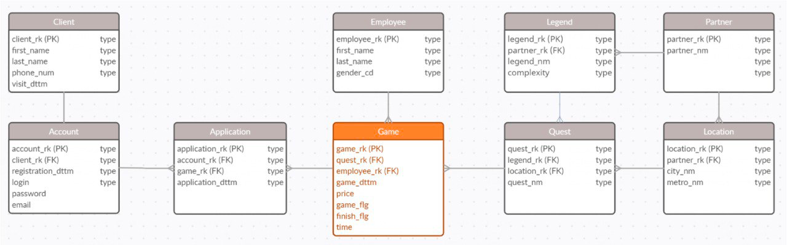

# Домашнее задание

## Описание

Все задания выполняются по модели данных из лекции

Ответ к каждому заданию ожидается из 3 пунктов:

1. Привести список новых сущностей, которые необходимо создать
2. Для каждой новой сущности проделать алгоритм, по которому необходимо её создать
    1. Указать список сущностей, которые необходимо использовать, чтобы получить новую сущность
    2. Указать с помощью каких атрибутов связать сущности
    3. Указать на какие атрибуты наложить фильтрации и какие это фильтрации должны быть
    4. Указать состав новой сущности: название, атрибуты, первичный ключ
3. Привести описание, как с помощью полученной итоговой сущности решить указанное задание

**Ограничение: каждая новая сущность должна быть получена не более чем из двух других**

**Ответ для примера из лекции может выглядеть следующим образом:**

1. "Легенды партнера Х", "Квесты партнера Х", "Игры партнера Х", "Игры партнера X за 2023 год", "Первая заявка на игру
   партнера Х", "Первая игра клиента у партнера Х", "Игры партнера за 2023 с флагом новой игры"
    2. Получение новых сущностей:
        1. Легенды партнера Х
            1. Для получения используются: partner, legend
            2. Связь сущностей: legend.partner_rk -> partner.partner_rk
            3. Фильтрации: partner.partner_rk = X
            4. Новая сущность legend_of_partner_x, атрибуты: legend_rk из legend.legend_rk. Первичный ключ - legend_rk
        2. Квесты партнера Х
            1. Для получения используются: quest, legend_of_partner_x
            2. Связь сущностей: quest.legend_rk -> legend_of_partner_x.legend_rk
            3. Фильтрации: не нужны
            4. Новая сущность quest_of_partner_x, атрибуты: quest_rk из quest.quest_rk. Первичный ключ - quest_rk
        3. Игры партнера Х
            1. .... (по аналогии с прошлыми примерами)
        4. Игры партнера X за 2023 год
            1. .... (по аналогии с прошлыми примерами)
        5. Первая заявка на игру партнера Х
            1. .... (по аналогии с прошлой сущностью)
        6. Первая игра партнера у клиента
            1. ..... (по аналогии с прошлыми примерами)
        7. Игры партнера за 2023 с флагом новой игры
            1. ..... (по аналогии с прошлыми примерами)
            2. Новая сущность game_of_partner_x_2023_with_new_flg. Атрибуты: game_rk из game_of_partner_x_2023,
               is_new_client_for_partner (1 если есть запись в first_game_of_client_for_partner_x по совпадению game_rk,
               иначе 0). Первичный ключ - game_rk
3. Среднее по game_of_partner_x_2023_with_new_flg.is_new_client_for_partner будет означать долю новых клиентов

## ДЗ

### Задача #1

#### Описание

**Задание.** Посчитайте количество игр, которые были проведены сотрудниками с фамилией X в 2023 году.

**Подсказка:** В итоговой сущности ожидаются атрибут, идентифицирующий сотрудника, и количество проведенным их игр.

#### Решение

1. "Сотрудники с фамилией X", "Игры за 2023 год", "Игры сотрудника с фамилией Х за 2023 год"
2. Получение новых сущностей
    1. Сотрудники с фамилией Х
        1. Для получения используются: employee
        2. Связь сущностей: -
        3. Фильтрации: employee.last_name = X
        4. Новая сущность employee_last_x: атрибуты: employee_rk из employee.employee_rk, Первичный ключ - employee_rk
    2. Активные Игры за 2023 год
        1. Для получения используются: game
        2. Связь сущностей: -
        3. Фильтрации: game.game_dttm.year == 2023 AND game.game_flag = 1
        4. Новая сущность: game_2023: атрибуты: game_rk из game.game_rk, employee_rk из game.employee_rk Первичный
           ключ - game_rk
    3. Игры сотрудника с фамилией Х за 2023 год
        1. Для получения используются:  employee_last_x, game_2023
        2. Связь сущностей: game_2023.employee_rk -> employee.employee_rk
        3. Фильтрация: -
        4. Новая сущность: games_2023_last_x_games, атрибуты: game.game_rk, employee.employee_rk, . Первичный ключ -
           game_rkLs
           employee_rk
       > (Вообще по employee_rk мы можем идентифицировать сотрудника, но если прям видеть надо, то надо из employee
       взять все атрибуты ещё на первом шаге и тут. Не до конца понял как правильно)

       > Ещё не до конца понял задание, и как будто можно было за одно действие это сделать и вставить все фильтры. Но
       если думать по порядку и по цифрам, то так выходит намного оптимальнее, потому что мы сначала фильтруем, а потом
       связываем сущности. Соответственно, работаем с меньшим кол-вом объектов. Надеюсь выбрал правильный вариант :)
3. Группировка по employee_rk, сумма по game_rk

### Задача #2

#### Описание

**Задание.** Посчитайте среднее количество завершенных* игр на клиента для клиентов, зарегистрированных в 2023 году.

*game.finish_flg - флаг того, что игра была завершена. Принимает значение 1, если игра была завершена, иначе 0.

**Подсказка:** В итоговой сущности ожидаются атрибут, идентифицирующий клиента, и количество завершенных им игр.

#### Решение

1. "Аккаунты зарегистрированные в 2023", "Клиенты зарегистрированные в 2023", "Завершённые игры", "Завершенные игры
   клиентов, зарегистрированных в 2023 году"
2. Получение новых сущностей
    1. Завершённые Игры
        1. Для получения используются: game
        2. Связь сущностей: -
        3. Фильтрации: game.finish_flg = 1
        4. Новая сущность: game_finished,
           атрибуты: game_rk из game.game_rk
           первичный ключ: game_rk
    2. Заявки на завершённую игру 2023
        1. Для получения используются: game_finished, application
        2. Связь сущностей: game_finished.game_rk -> application.game_rk
        3. Фильтрации: -
        4. Новая сущность: application_game_finished,
           атрибуты: game_rk game_finished.game_rk
           первичный ключ: game_rk
    3. Аккаунты, подавшие заявки на завершённую игру
        1. Для получения используются: game_finished, application
        2. Связь сущностей: game_finished.game_rk -> application.game_rk
        3. Фильтрации: -
        4. Новая сущность: application_game_finished,
           атрибуты: game_rk game_finished.game_rk
           первичный ключ: game_rk
    4. Клиенты зарегистрированные в 2023
        1. Для получения используются: account, client
        2. Связь сущностей: account_2023.client_rk -> client.client_rk
        3. Фильтрации: account.registration_ddmm.year = 2023
        4. Новая сущность: client_2023
           атрибуты: client_rk из account.client_rk,
           первичный ключ: client_rk
3. Группировка по employee_rk, сумма по game_rk

