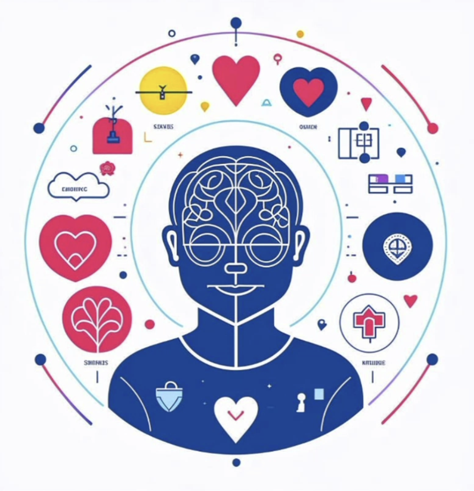

# Продуктовая студия

## Активности
- Работа над проектом. 
  - Рандомно разделят на группы по 3-4 человека
  - Закрепляют ментора
  - В начале декабря будет защита
- Важно
  - Закоммититься на это (захотеть участвовать)
- go practice 
  - Симулятор проекта\продукта

## Что такое продукт? 
Продукт – решение, которое одновременно удовлетворяет потребности клиента и позволяет бизнесу расти.

Примеры продуктов в Tinkoff:
- Лендинг
- Talk
- Кредитная карта
- Ассистент Олег

## Кто такой продакт? 
Продакт менеджер находится на стыке бизнеса, пользователя и технологии. 

- Клиент пользуется продуктом
- Бизнес – то, как мы зарабатываем на этом продукте
- Технология – то, как мы этот продукт реализуем

Задача понять что нужно клиенту, как на этом продукте зарабатывать, и как (с помощью каких технологий)
это можно реализовать 

Продакт менеджер – всегда крайний. Если не нравится пользователю, если не зарабатывает, если ракета не полетела, то 
всегда виноват продакт менеджер  

Продакт делает всё не один. У него есть дизайнеры, маркетологи, финансисты, программисты, разработчики, 
которые помогают ему с разных сторон. Важная задача уметь это координировать и держать всё вместе

## Роль продакт менеджера

- Органы чувств, включая 6-е – визионер (стратегия), понимание потребностей пользователя
- Мозг – decision maker. Приоритизация фич (Как заработать деньги? Как привлечь и удержать пользователя?)
- Сердце – двигатель, мотивация команды, координация, любовь к клиенту

## Что нужно (делать) продакту
- Софт скиллы (лидерство, координация)
- Пользовательские исследования
- Числовая аналитика
- Понимание IT (архитектура, системным анализ)
- Delivery (project management)
- Бизнес аналитика. 
- Маркетинг

## Один ~~день~~ проект из жизни продакта
Проверка работы через доступ к госуслугам 

## Цикл HADI
1. Формулируем гипотезу
2. Проверяем гипотезу
3. Смотрим на данные
4. Делаем выводы

## Что такое продуктовый подход?

1. Начни с вопроса. Почему и зачем?
2. MVP, тестируй, учись
3. Выводы делаются на данных
4. Пользователь в центре всего 

### Правило 5 зачем 
Как увеличить продажу молочных коктейлей в макдональдсе? 

Первым делом был опрос. Что вы хотите больше: вкусов\размеров\другие стаканчики

Это всё попробовали, но это не сработало 

4 волшебных буквы: 
**JTBD** – Job To Be Done

1. **Зачем пользователю наш продукт?** (молочный коктейль). Оказалось, что 50% покупок молочного коктейля происходит в 8 утра
Это делают люди, которые едут на работу, потому что они ещё не голодные, но что-то около сытное и удобно пить из машины. 
И чтобы всё было вкусненько. Коктейль сделали более жирным, больше размеров, продажи выросли в n ~~(7)~~ раз
2. **MVP – Minimum Viable Product**
   - Минимально сложное решение
   - Легко проверить самую смелую гипотезу
   - Настраивай быструю петлю обратной связи
   - Мысли много, начинай с малого 
   
**Пример из Тинькофф:** 5 лет назад в Тинькофф думали, можно ли автоматизировать продажи по телефону
Хотели, чтобы не сотрудники продавали товары\услуги, а робот. 
Продакт записал себя на диктофон (5-10 записей) каких-то продажных тезисов
Посадили человека, который выбирал записи озвучки в зависимости от того, что говорил клиент. Поняли,
что диалог так можно вести и начался speech to text, роботы и так далее 
3. **User centricity**
Слышать клиента $\neq$ делать то, что он просит 
4. **Data Driven** 
Решения должны основываться на данных. 

Стали по понедельникам делать классную шаурму, а по пятницам пиццу. Это сработало и больше людей стало приходить 
Примеры data driven в Tinkoff:

Делаем несколько вариантов и сравнивают. 

## Особенности продуктового подхода в Tinkoff
- Клиентские продукты: дебетовка, пульс, эквайринг
- Бизнес: портфель кредитов
- Процессы: origination, обслуживание, growth
- Платформы: talk, Dev Platform, Sage
- AI: ассистент Олег, чат боты

**Три типа продакт менеджера**
- **Core PM.** Продукты для розничных клиентов и юрлиц, часто мобильные приложения
  - Поиск PMF
  - Рост числа клиентов
  - Рост платящей аудитории и выручки
  - Счастье клиента, юзабилити
  Наибольшее влияние ЦА, скорее учет фидбека. 
  **Целевая аудитория**: Розничные клиенты, SMB 
- Ещё какой-то
- И ещё какой-то, не успел записать. Если есть скрин\фотка слайда, кидайте в issues\личку, дополню 

## Ценности продакт менеджеров в Tinkoff
- Секретный ингредиент 
- Внимание к деталям
- Деньги, дофамин, технологии 

Все в деталях. Вы хорошо понимаете клиентов, вы хорошо понимаете цифры, вы хорошо понимаете бизнес 
Не замалчиваете идеи, не замалчиваете проблемы. Быть problem-solver'ом. 

## С чего начинать путь в продакты? 
- Аналитик
- Технолог (проджект)
- Любая профессия (Разработчик, маркетолог, дизайнер)
- Маленькие продукты

## Стадии развития продукта
1. Разработка
   - Слышать пользователя
   - Определить планы пользователя
2. Введение
3. Рост
4. тут было что-то сложное на английском, я не успел перевести и не понял что там
5. Экстренный выход

## Будущее продакт менеджмента
Есть два больших тренда. 
1. ESG 
2. AI

## Домашнее задание
- Пройти распределение по командам, познакомиться с коллегами и своим ментором
- Посмотреть материалы по ChatGPT от нас
- Поштормить с командой над идеями продуктов, выбрать один из них, который вы будете дальше прорабатывать
- Почитать про инструмент [Lean Canvas](https://www.leancanvas.com/) и сделать его MVP. 

