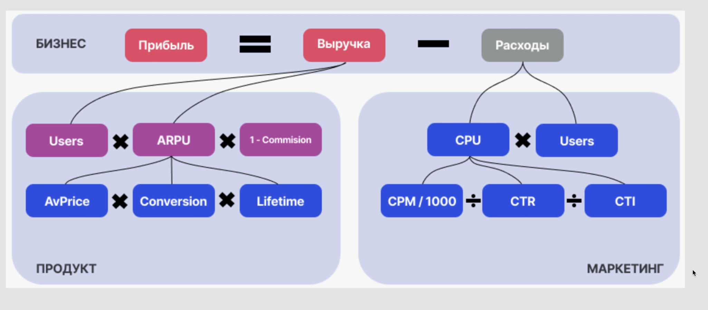
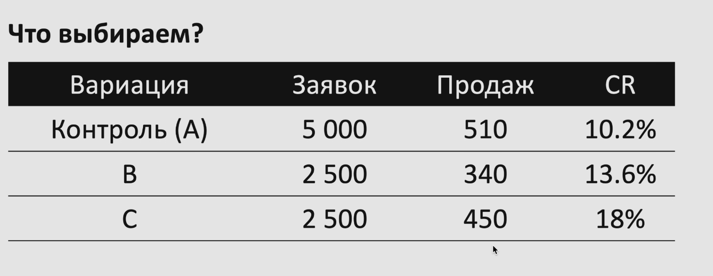
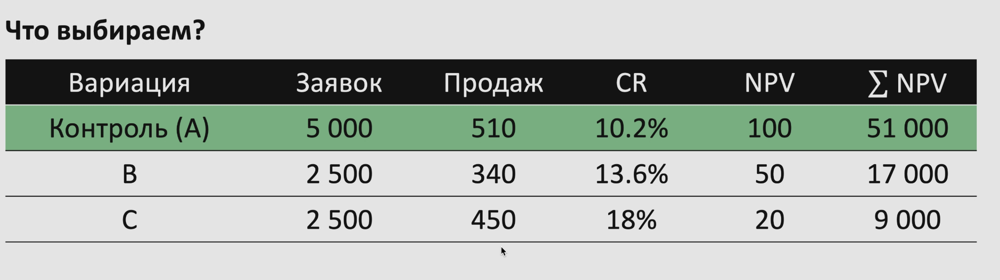
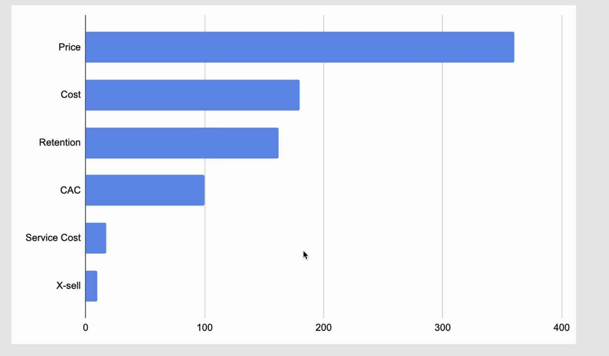

# Метрики и unit-экономика
Юрий Смелов 

О чём поговорим? 
1. Управление продуктов. Что это и при чём тут метрики?
2. Как выбирать метрики? Дерево метрик как модель бизнеса
3. NPV \ LTV. Вся unit-экономика 
4. NPV подход. Принятие решений на основе NPV

**Управление продуктом - что это значит?**  
Управление продуктов - про принятие **правильных** решений для достижения целей бизнеса 
в условиях неопределенности  и ограниченности ресурса 

**Хорошее решение vs правильное:**
- В 1975 Kodak изобретают первую цифровую камеру
- Решают не терять прибыль от продажи пленки и отказываются развивать направление
- В 2012 Kodak подают на банкротство 

## Человек - корова 99%
- Неокртекст потребляет много энергии
- Большинство решений на автомате или на эмоциях 

**Когнитивные искажения**
Как способ экономии энергии мозгом:
1. Знакомое - истина
2. Первое впечатление перекрывает всё
3. Предвзятость подтверждения 

**Метрики про качество решений**

- Включают мозг
- Ограничивают искажения и эмоции
- Снижают неопределённость 

С цифрами мозгу проще, потому что мозг не может эмоционировать на казино 

**Но есть нюанс**

Аналитический паралич тоже плохо  

Неопределенность - это нормально, потому 6 чувство и насмотренность никто не отменял 

## Метрики
**Цели бизнесы – тоже про метрики**
- BHAG (5-25 лет) Большая волосатая дерзкая цель
  - Лучшая финтех экосистема в мире
- NSM (3-5 лет) Метрика полярной звезды
  - 50 млн активных клиентов 
- OKR ($\leq 1$ год) Цели и ключевые результаты. 
  - Показывает операционные метрики, чтобы достичь NSM и BHAG 

## Кейс YouTube 
Или как выбор правильной метрики и фокуса определяет успех

Прибыль ~ Доход от рекламы ~ Количество показов рекламы ~ Просмотры 

**Менее очевидный путь:**
- 1 млрд часов просмотров в неделю

## Дерево метрик - как модель бизнеса
Показывает, от чего зависят основные денежные потоки 

ARPU - Average revenue per user

## Фреймворк AAARRR
a.k.a пиратские метрики - хороши для Growh Hacking'a

1. Awareness – До какого кол-ва клиентов мы дотянулись? Click/View (CPC, CTR, Reach) 
2. Acquisition - Сколько человек посетило сайт? (Заинтересовалось? ) Lead (visit-lead CR, CAC)
3. Activation - Как много людей сделали самый важный шаг (Нажали на кнопку\начали взаимодействие) Sign-up (lead-sign up CR)
4. Revenue (Как много людей готовы платить и сколько? ) Deal (sign-up-deal CR, Deal Size, Profit)
5. Retention - Как много людей вернутся и купят обратно? Renewals (Retention Rate, LTV)
6. Referral - Как много людей позовут своих друзей в свой продукт  Share (NPS, CSAT, Referrals)

## Теперь про unit-экономику

### Начнём с простого
Что выбираем:
100 y.e. сейчас или 200 y.e. счерез год?

It depends:
1. 100 сейчас, через год я сделаю 300 (моя ставка доходности $i=200%$)
2. 200 через год, так как из 100 я сделаю только 150 ($i = 50%$)

### На помощь приходит NPV
Как линейка для принятия решений

**NPV - Net Present Value** (чистая приведенная стоимость), делает сравнимым все будущие **CF** (Cash flow) от продукта / решения / клиента

**NPV** считается относительно альтернативы "безрисковой доходности" - ставки дисконтирования i

**IRR - Internal Rate of Return** (внутренняя норма доходности) - ставка дисконтирования, при которой 
NPV продукта = 0. По сути показывает, сколько годовых вы зарабатываете от инвестиций **IC** в продукт 
$$ NPV = -IC + \sum_{t=1}^{n} \frac{CF_t}{(1 + i)^t}$$

**LTV (Lifetime Value) ** - то же NPV, просто NPV чаще про монопродукт, а LTV про экосистему 

### NPV клиента - модель unit-экономики
- NPV - про предсказание, попадание (фит модели) нужно регулярно проверять
- Важно смотреть NPV по сегментам / каналам, чтобы быстрее находить проблемы

## Долгосрочный рост прибыли коррелирует с ростом всех NPV
Пример связи NPV  и PnL: компания привлекает клиентов первые 10 лет, клиент живёт 10 лет

Копать яму ок, если NPV потока $> 0$ и есть деньги

## NPV подход

### Базовое правило **NPV-положительные решения** 
Это способ повышения **вероятности** правильности решения

Что выбираем?

Но не всё можно протестировать / посчитать – прыжки веры тоже опция 

### Торнадо-диаграмма:
Дает понимание точек роста доходности. Показывает на сколько меняется NPV при изменении параметров модели на 10%: 

## И напоследок 
Без метрик не построить великого, но их использование не нужно превращать в карго-культ

**Создавайте то, что взлетит**

## Домашнее задание
- Сформулируйте BHAG и NSM вашего проекта
- Простройте дерево метрик и актуализируйте блок метрик в Lean Canvas
- Составьте приблизительную модель NPV