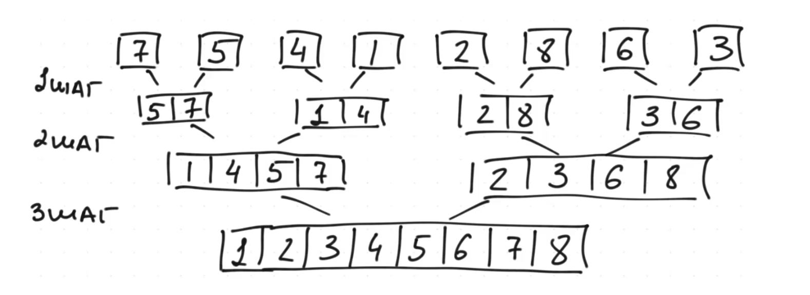
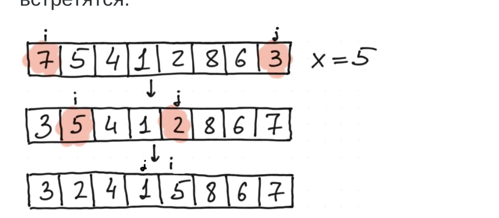

# Сортировки

## Сортировка вставками (Insertion sort)

Идея: В каждый момент времени массив разделён на две части: отсортированную (слева) и неотсортированную (справа).

На очередной шаге берём первый элемент из неотсортированной части и направляем его в отсортированную часть.

Продолжаем, пока не отсортированная часть не опустеет.

```python3
def insertion_sort(arr):
    for i in range(1, len(arr)):
        j = i
        while j > 0 and arr[j - 1] > arr[j]:
            arr[j - 1], arr[j] = arr[j], arr[j - 1]
            j -= 1
```

Внешний цикл: Проходим по всем элементам , начиная со второго.

Внутренний цикл: Пока не дошли до начала массива меняем элементы местами

Сложность: $O(n^2)$

## Можно ли быстрее?

Да, можно. Например, с помощью сортировки слиянием.

## Слияние

Решим задачу попроше: даны два отсортированных массива, нужно объединить их в один отсортированный.

Идея: воспользуемся методом "двух указателей"

```python3
def merge(a, b):
    res = []
    i, j = 0, 0
    while i < len(a) and j < len(b):
        if b[j] < a[i]:
            res.append(b[j])
            j += 1
        else:
            res.append(a[i])
            i += 1
    res.extend(a[i:])
    res.extend(b[j:])
    return res
```

Сложность: $O(n_a + n_b)

## Сортировка слиянием (merge sort)

Сортировка слиянием - сортировка оптимистов

Дано $n$ отсортированных массивов длины 1

Идея: будем объединять массивы попарно, пока не получим один отсортированный массив.

Наиболее простым образом алгоритм реализуется рекурсивно

```python3
def merge_sort(arr):
    if len(arr) <= 1:
        return arr
    mid = len(arr) // 2
    left = merge_sort(arr[:mid])
    right = merge_sort(arr[mid:])
    return merge(left, right)
```

Сложность: $O(n log n)$

Дополнительная память: $O(n)$


## Быстрая сортировка (Quick Sort)

В предыдущем алгоритме мы сортировали две части массива, а затем собирали их вместе.

Идея быстрой сортировки немного обратная

### Разбиение

Что значит переупорядочить нужным образом?

Это значит, разбить массив на 2 части так, чтобы в первой были элементы, меньше либо равные, чем во второй (разбиение)

Идея: Если нам удастся выполнить разбиение, то затем будет достаточно рекурсивно отсортировать две части

Существует несколько способов выполнить разбиение. одним ииз наиболее простых является разбиение Хоара:

Идея: Выбираем некоторый опорный элемент $x$. Ищем первый элемент слева, который $\geq x$ и первый элемент справа,
который $\leq x$. Меняем их местами. Повторяем, пока левый и правый указатели не встретятся



```python3
def partition(arr, l, r):
    x = arr[(l + r) // 2]
    i, j = l, r
    while True:
        while arr[i] < x:
            i += 1
        while arr[j] > x:
            j -= 1
        if i >= j:
            return j
        arr[i], arr[j] = arr[j], arr[i]
        i += 1
        j -= 1
```

Сложность $O(n)$

## Быстрая сортировка (Quick Sort)

```python3
def quick_sort(arr, l, r):
    if l < r:
        m = partition(arr, l, r)
        quick_sort(arr, l, m)
        quick_sort(arr, m + 1, r)
```

Сложность зависит от того, как выполняется разбиение.

Если опорный элемент выбирается неудачно (так, что отделяется несколько элементов), то сложность будет $O(n^2)$

Если опорный элемент разбивает массив на примерно равные части, то сложность будет $O(n log n)

На практике, опорный элемент выбирают случайно. Это позволяет защититься от специально подобранных сложных случаев.

В таком случае говорят, что алгоритм работает в среднем за $O(n log n)$

## Можно ли ещё быстрее?

Нет.

Теорема.
Сортировки, основанные на сравнениях, работают за $\Upomega (n log n)$ в среднем.

Доказательство (если успеем)

Однако! Если помимо сравненй можно использовать другие операции, то можно сортировать быстрее (в том числе за линейное
время).

## Сравнение сортировок

- merge sort
    - Сложность в худшем случае $O(n log n)$
    - Худший случай $(n = 8)$ [5, 1, 7, 3, 6, 2, 8, 4]
    - Сложность в среднем случае $O(n log n)$
    - Требование по памяти $O(n)$
    - Стабильность: Cтабильный
    - Применение: Link List плохо работает, потому что дорогая операция обращения к элеменатам
- quick sort
    - Сложность в худшем случае $O(n^2)$
    - Худший случай $(n = 8)$ [0, 1, 2, 3, 4, 5, 6, 7]
    - Сложность в среднем случае $O(n log n)$
    - Требование по памяти $O(1)$
    - Стабильность: Yt Стабильный
    - Применение: Хорошо применять, когда Link List. В структуре, в которой мы не можем прочитать случайный элемент и
      прочитать его

Сортировка слиянием хоть и квадратичная, но в некоторых кейсах это может быть предпочтительно, так как мы делаем всего n
swap-ов, что означает если нам перекладывать объекты, то это может быть оптимальнее


# Встроенная функция sorted
```python
sorted_list = sorted(iterable, /, *, key=None, reverse=False)
```

sorted = вставки (маленькие массивы) + merge (большие массивы)

Что такое / и *??

 Символы / и * отделяют разные типа аргументов:
- До / идут positional-only аргументы - их нельзя вызывать по имени
- После * идут key_word 


